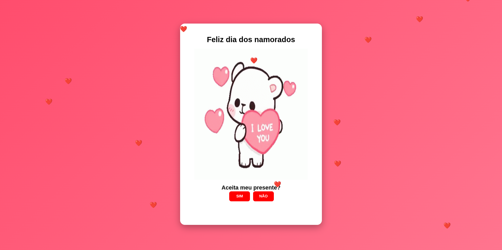

# ❤️ Projeto Dia dos Namorados

Uma página web interativa criada para presentear minha namorada no Dia dos Namorados e praticar conceitos de desenvolvimento Front-End utilizando HTML, CSS e JavaScript.

## 📖 Sobre o projeto

Este projeto consiste em uma página temática de Dia dos Namorados contendo:

* GIF animado de um ursinho apaixonado.
* Botão **SIM** para aceitar o presente.
* Botão **NÃO** que foge do cursor do mouse (ou do toque).
* Chuva de corações animados pela tela.
* Layout responsivo para computadores, tablets e smartphones.

O objetivo foi unir criatividade, programação e aprendizado em um único projeto.

## 🕹️ Como funciona

Após abrir a página, o usuário encontrará uma mensagem romântica acompanhada por um ursinho animado.

Ao tentar clicar em **NÃO**, o botão muda de posição aleatoriamente pela tela, tornando impossível recusá-lo.

Ao clicar em **SIM**, uma mensagem especial é exibida.

## 📸 Preview



## 🛠️ Tecnologias utilizadas

### Front-End

* HTML5
* CSS3
* JavaScript

### Recursos utilizados

* Flexibilidade com Media Queries
* Animações CSS
* Manipulação do DOM
* Eventos JavaScript
* Responsividade

## 📂 Estrutura do projeto

```text
Projeto-Dia-dos-Namorados/
│
├── index.html
├── style.css
├── script.js
│
├── images/
│   ├── ursinho-fofo-apaixonado.gif
│   └── ursinho-fofo.gif
└── README.md
```

## ⚙️ Funcionalidades

- Corações são gerados dinamicamente utilizando JavaScript e animados com CSS.
- Ao aproximar o cursor ou tocar no botão NÃO, ele é reposicionado aleatoriamente na tela.
- O layout foi adaptado para funcionar em diferentes resoluções e dispositivos.
- Ao clicar em **SIM**, uma mensagem personalizada é exibida ao usuário.

## 🎯 Objetivos de aprendizado

Durante o desenvolvimento deste projeto foram praticados conceitos como:

* Estruturação semântica com HTML.
* Estilização com CSS.
* Responsividade utilizando Media Queries.
* Manipulação de elementos com JavaScript.
* Eventos de mouse.
* Animações CSS.
* Organização de arquivos de um projeto Front-End.

## 🌐 Como executar o projeto

1. Clone o repositório:

```bash
git clone https://github.com/Brandoon001/dia-dos-namorados.git
```

2. Entre na pasta:

```bash
cd dia-dos-namorados
```

3. Abra o arquivo `index.html` em seu navegador.

## 🌐 Demonstração

[Visualizar Projeto](https://brandoon001.github.io/dia-dos-namorados)

## 👨‍💻 Autor

**Brandoon Silva**

- GitHub: [Brandoon001](https://github.com/Brandoon001)
- LinkedIn: [Brandoon Silva](https://www.linkedin.com/in/brandoon-silva-352894215/)
- Email: brandoonsilva8@gmail.com

## 📜 Licença

Este projeto foi desenvolvido como uma forma criativa de unir programação e uma data especial, servindo também como prática dos meus estudos em desenvolvimento web.